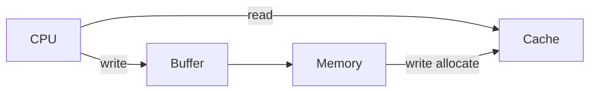
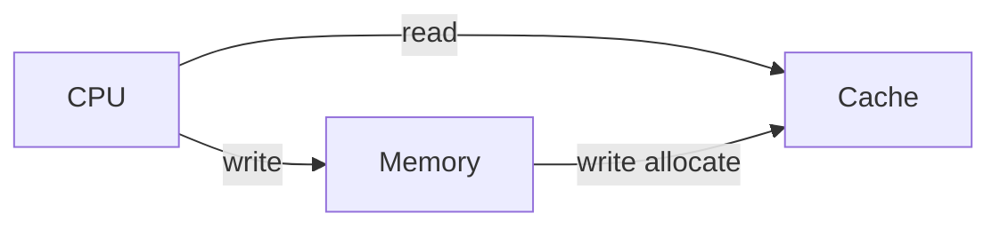

# ELEC3441_Hw2
**JIANG Feiyu 3035770800**
## A.1 Resolving Branch Hazards
### 1.1

| Sequence | Instruction Address | Instruction | Branch Taken? (Y/N) |
| --- | --- | --- | --- |
| 1 | I10 | beqz | Y |
| 2 | I14 | bnez | Y |
| 3 | I10 | beqz | Y |
| 4 | I14 | bnez | Y |
| 5 | I10 | beqz | Y |
| 6 | I14 | bnez | Y |
| 7 | I10 | beqz | Y |
| 8 | I14 | bnez | Y |
| 9 | I10 | beqz | Y |
| 10 | I14 | bnez | Y |
| 11 | I10 | beqz | N |
| 12 | I14 | bnez | Y |
| 13 | I10 | beqz | N |
| 14 | I14 | bnez | Y |
| 15 | I10 | beqz | Y |
| 16 | I14 | bnez | Y |
| 17 | I10 | beqz | Y |
| 18 | I14 | bnez | Y |
| 19 | I10 | beqz | N |
| 20 | I14 | bnez | N |

### 1.2
$Required\ cycles = 2 +7\times15+2\times(15+1)+1\times(15+1+3)=158$.
When considering the initial latency, $11+158=169$ cycles are needed.
### 1.3
An 4 cycles delay will occur for misprediction of one branch. Thus, the $required\  cycles = 2+7\times(11+4+4)+2\times(11+1+4)+1\times(11+1+3)=182$

When considering the initial latency, $11+182=193$ cycles are needed.
### 1.4
There will be $20 \times 5% = 1$ mispreiction, thus, $Required\ cycles=2+7\times11+2\times(11+1)+11+1+3+4=122$. 

Considering about the initial latency, $11+122=133$ cycles are needed.
### 1.5
$S1\ time = 168\times1=169$

$S2\ time=193 \times 1.5=289.5$

$S3\ time =133 \times 2 =266$

$S1<S2<S3$, thus, S1 is the best.

## A.2 Cache Access
### 2.1


Assume all data in main memory contain the value `0x0EEE3441`. According to the question, 
- Capacity: 512B  
- Line size: 8 words  
- Organization: direct map  
- Policy: write back, write allocate

$offset\ size = log_{2}(line\ size \times4) = 5\ bit$

$index\ size=log_{2}(cache\ capacity/line\ size) = 4 bit$

Thus, the tag size should be:

$32 − offset\ size − index\ size = 23 bit$

As we know, the structure of each line is `tag 23bit + index 4bit + offset 5bit`. 

**Cache access:**
| Address (hex) | Type | index | tag | Hit/Miss| Reason |
| --- | --- | --- | --- | --- | --- |
| BA443E98 | R | 0100 | 0x5d221f | H | |
| BA443FA8 | W | 1101 | 0x5d221f | H | Compulsory |
| 54E99A88 | R | 0100 | 0x2a74cd | M | Compulsory |
| 54E99BB8 | R | 1101 | 0x2a74cd | M | Compulsory |
| 30013C80 | R | 0100 | 0x18009e | M | Compulsory |
| 54E99A84 | R | 0100 | 0x2a74cd | M | Conflict due to 54E99A88 |
| 54E99BA0 | R | 1101 | 0x2a74cd | H | |
| BA443FA4 | W | 1101 | 0x5d221f | M | Conflict due to BA443FA8 |
| 54E99A90 | W | 0100 | 0x2a74cd | H | |
| BA443E88 | W | 0100 | 0x5d221f | M | Conflict due to BA443E98 |

**file content**

<p align=center></p>

### 2.2
the structure of each line is `tag 24bit + index 3bit + offset 5bit`.

**Cache access:**

| Address (hex) | Type | index | tag | Hit/Miss| Reason |
| --- | --- | --- | --- | --- | --- |
| BA443E98 | R | 100 | 0xBA443E | H | |
| BA443FA8 | W | 101 | 0xBA443F | H | Compulsory |
| 54E99A88 | R | 100 | 0x54E99A | M | Compulsory |
| 54E99BB8 | R | 101 | 0x54E99B | M | Compulsory |
| 30013C80 | R | 100 | 0x30013C | M | Compulsory |
| 54E99A84 | R | 100 | 0x54E99A | H | |
| 54E99BA0 | R | 101 | 0x54E99B | H | |
| BA443FA4 | W | 101 | 0xBA443F | H | |
| 54E99A90 | W | 100 | 0x54E99A | H | |
| BA443E88 | W | 100 | 0xBA443E | M | Conflict due to BA443E98 |

**file content**

<p align=center></p>

### 2.3
the structure of each line is `tag 27bit + offset 5bit`.

**Cache access:**

| Address (hex) | Type  | tag | Hit/Miss| Reason |
| --- | --- | --- | --- | --- |
| BA443E98 | R | 0x5D221F4 | H | |
| BA443FA8 | W | 0x5d221FD | H | Compulsory |
| 54E99A88 | R | 0x2a74cd4 | M | Compulsory |
| 54E99BB8 | R | 0x2a74cdD | M | Compulsory |
| 30013C80 | R | 0x18009e4 | M | Compulsory |
| 54E99A84 | R | 0x2a74cd4 | H | |
| 54E99BA0 | R | 0x2a74cdd | H | |
| BA443FA4 | W | 0x5d221fd | M | Compulsory |
| 54E99A90 | W | 0x2a74cd4 | H | |
| BA443E88 | W  | 0x5d221f4 | H | |

**file content**

<p align=center></p>

### 2.4
The minimum number of misses is 3. Here is one possible design:

| Cache Parameter | Range |
| --- | --- |
| capacity | 256 B |
| line size | 16 words |
| set associativity | 4 |
| write miss policy | write allocate |

## A.3 Simple Pipeline
### 3.1 
According to the program, there are 100 loops in total, for each loop, $a_{0} += (100 + 17), a{1} += (100 − 17)$. 

When the loop ends, $a_{0}=10485760 + 100 \times 117 = 10497460$, while $a_{1}=10559596$ 

Since there are four consecutive add out of the loop, $ a_{0} = 16 × 10497460 = 167959360 = 0x0A02DB40$, and similarly, $a_{1} = 0x0A1206C0$

### 3.2
$5 + 14 \times 100 + 8 = 1413$ cycles

### 3.3
load use hazard
```
lw t2, 0(s1)
add t3, t1, t2
```

### 3.4
For each Load, the Load Use hazard will cause 4 extra cycles as penalty, which happens for 100 times.

Branch misprediction will cause 3 more cycles as penalty, which happens for 99 times.

Thus,
$CPI=\frac{1413+99\times3+4\times100}{1413}=1.49$

## A.4 Streaming Cache Performance
## 4.1
```
loop:
    RM * 2
    RH * 7 * 2
    WH * 8
```
$\frac{2^{10}}{8}=128\ times$

## 4.2
The $Miss\ rate=\frac{2\times\frac{1024}{8}}{3\times1024}=0.0833$

The $AMAT = Hit\ time + Miss\ rate \times\ Miss\ Penalty = (7\times2+8)\times1+\frac{1}{12}\times300=26\ cycles$

## 4.3 
$Total\ run\ time = (5\times1+\times4+26\times3)\times N=91N$

## 4.4 
Relacement policy: LRU is applied in the final $2^{3}$ loops.

$2^{23}>2^{20}$, the size of array is greater than the cache capacity.
```
loop:
    RM * 2
    RH * 7 * 2
    WH * 8
```
Miss rate doesn't change.

## 4.5



All Read is before Write in the code. Therfore there is no difference in cache content except for the dirty bit.
|  | Read miss penalty |Write miss penalty |Overall performance of the above code |
| --- | --- | --- | --- |
| with write buffer | no effect | no effect |no effect |
| without write buffer | decrease | increase | unknow, almost balanced |

Explanation:

Without write buffer, cache fetches data from memory, thus, read miss penalty decrease; CPU needs to write the cache by the data from memory, thus, write miss penalty increase; the overall performance can't be determined if the read/miss penalty is unknown, the read and write miss penalty are almost balanced.
