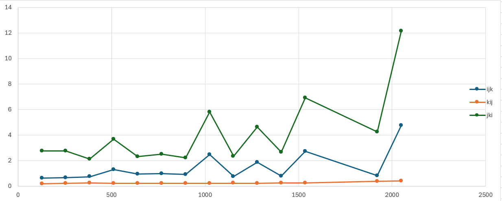

# ELEC3441 Hw_3 Gp

- `Bao Xinyang 3035952989`
- `Jiang Feiyu 3035770800`
- `Yuen Ho Shing 3035930943`

Attachments:
    - Modified codes for ref: `./code`
    - Raw data and data analytical tools: `./data`

<div STYLE="page-break-after: always;"></div>

### B 1.2
**IJK**: Each iteration requires 2 load instructions. Load from `a[i*N+k]` will miss every 4 iterations, and load from `b[k*N+j]` will miss every iteration.

**KIJ**: Each iteration requires 1 load instruction and 1 store instruction. Load from `b[k*N+j]` and store to `c[i*N+j]` both will miss every 4 iterations.

**JKI**: Each iteration requires 1 load instruction and 1 store instruction. Load from `a[i*N+k]` and store to `c[i*N+j]` both will miss every iteration.

### B 1.3
**IJK**: In the most inner loop, the matrix a is accessed row-wise and the matrix b is accessed column-wise. The column of matrix b increases with the second inner loop and the row of matrix a increases with the out-most loop.

**KIJ**: In the most inner loop, the matrix b is accessed row-wise. In the second inner loop, the matrix a is accessed column-wise. The row of matrix b and the column of matrix a increase with the out-most loop.

**JKI**: In the most inner loop, the matrix a is accessed column-wise. In the second inner loop, the matrix b is accessed column-wise. The row of the matrix a increases with the second inner loop and the row of matrix b increases with the out-most loop.

<div STYLE="page-break-after: always;"></div>

### B 1.4
Please refer to the `./data/data_anyl.ipynb` and `./data/result.csv` for codes and raw data.

<p align=left></p>

According to the diagram above, the time taken of $jki > ijk > kij$, which aligns to the analysis in `1.2`.

<div STYLE="page-break-after: always;"></div>

### B 1.5
Please refer to the `4.ipynb`, `result.csv`,`result 0-20-10.csv`,`result 0-10-50.csv`,`result-0-40-10.csv`, `result-0-100-10.csv`, `result-0-200-20.csv` for codes and raw data.

Before actual running, it is predictable that there will be two "fault lines", indicating L1 and L2 size, respectively. 

<p align=left></p>

However, there is only an observable "fault line" around 500-600. Due to the large number and the miss of the second fault line, which does not exist even if the size grows to 1200, there are two reasonable guesses:

1. The only fault line indicates L2 cache, which means L2 cache has a size between 512 and 1024. 
    
    The L1 cache is very small, which is not shown in the picture. An experiment with a smaller size should be done. 

    <p align=left></p>

    The smaller experiment does not show fault lien either. Therefore, either the L1 cache has little performance difference from L2, or the second guess holds. 

2. The only fault line indicates L1 size, which means L1 cache has a size between 512 and 1024. L2 cache has a very large size that can only be tested under high pressure.

Here are some other diagrams we plot:
-  BASE  0; ITERS 10; DELTA 50

    

-  BASE  0; ITERS 20; DELTA 10

    <p align=left></p>


-  BASE  0; ITERS 40; DELTA 10

    <p align=left></p>

-  BASE  0; ITERS 100; DELTA 10

    <p align=left></p>


After observation, we can conclude that there is a turning point for `ijk`, `kij`, and `jki` around the Length of 250-300. Therefore, we can infer that the L1 cache is full at this point, indicating that the L1 Cache Size should be around 300.

### B 1.6


$2\times block\ size \leq\ cache\ size$

<div STYLE="page-break-after: always;"></div>

### B 1.7
Please refer to the `./data/data_anyl.ipynb` and `./data/block.csv` for codes and raw data.

<p align=left></p>

It is observable that there are two "fault lines", namely from 16 to 64 block size and from 128 to 512 block size. With the existence of the L1 cache and L2 cache, we can deduce that the L1 cache can store $2\times64\times64$ elements at once and the L2 cache can store $2\times512\times512$ elements at once (because every loop takes two `mem` accesses). 

From the code, elements are double values, so the L1 cache is $2\times 64\times 64\times 8 B=64 KB$, and the L2 cache is $2\times 512\times 512\times 8 B=4 MB$. 

While running times of block sizes 16 to 64 are the lowest, `64` is theoretically the most efficient block size. 

<div STYLE="page-break-after: always;"></div>

### B 1.8
Taking the best performance block size 64, the performance of the blocked matrix is better by:
```
    ijk: 7.950013546,
    kij: 1.899503608,
    jki: 27.889432819
```


### B 1.9
While the block technique basically changes the smallest unit being calculated and cached, it is predictable that the same best order in the infer technique will also be the best for the combination technique. Therefore, the best order is still `kkiijj`. 

