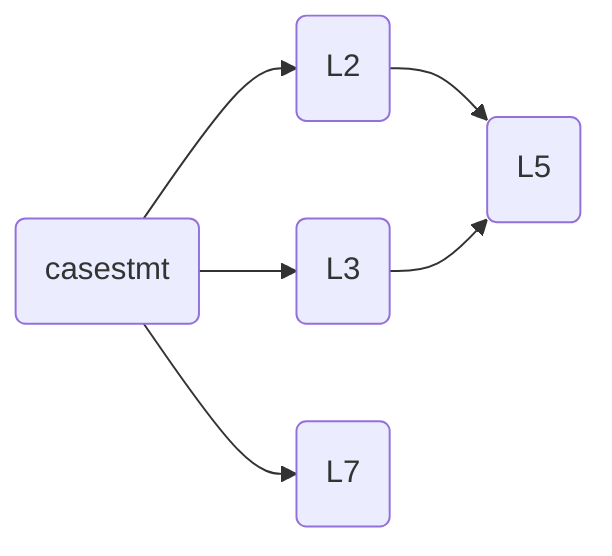
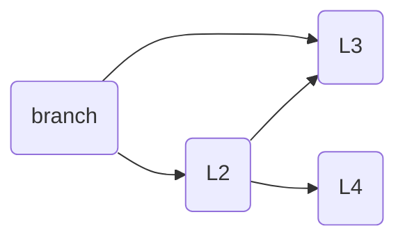

# Lab 1 of ELEC3441
**Jiang Feiyu - UID: 3035770800**

## 1.8 Loops Compile the 2 files loop1.c and loop2.c using different optimization level similar to the above questions. Then answer the following questions:
##### How does the compiler implement the two different loops?
- Loading and storing values from memory
- Performing arithmetic operations
- Updating loop variables
- Loop termination conditions

To be more specific, using loop 1 for example:
1. The code firstly allocates 80 bytes on the stack. The stack is used to save the value of the register and move the execution of the program to the location of the tag `.L2`.
2. Loop `.L2` performs a signed comparison, and if the value of register `a4` is less than or equal to the value of register `a5`, it jumps to the location of the label `.L3`, otherwise execution continues to `.L4` Labels. This step is used to perform the judgment of the loop condition.
3. In loop `.L3`, the increment operation is performed, while the addition inside the loop is performed and the new value is stored back into the stack frame.
4. ` .L4` continues to be responsible for determining the conditions under which the second loop proceeds and executes `.L5` if the conditions are still not met. Otherwise, free space and end the function. `L5` is similiar to `L3`, the increment and addtion operation is performed.

    ```mermaid
    graph LR
        A(loop 1) --> B(L2)
        B(L2) --> C(L4)
        B(L2) -.-> D(L3)
        C(L4) -.-> E(L5)
    ```

    ```mermaid
    graph LR
        A(loop 2) --> B(L2)
        B(L2) -.-> C(L3)
    ```

##### How many instructions are needed for the two loops?
74 lines of instruction needed with no optimization and 13 lines needed for O1 and O2 optimization.
##### How does the generated code differ with -O1 -O2 and no optimization?
Since this both C program has no return value and no output, the optimization simply omits the internal operations that are not relevant to the output.

<div STYLE="page-break-after: always;"></div>

## 1.9 If-then-else vs. Switch Compile the files branch.c and case.c as before and answer the following questions:

##### How does the compiler implement the following two code segment differently?
- `case` uses the `beq` instruction for conditional branch evaluation, while `branch` uses the `bne` instruction for conditional branch evaluation.





- In `case`, the input parameter is first compared to constants, and then a jump is made based on the result of the comparison. On the other hand, in `branch`, the first condition is compared, and then labels are sequentially jumped to for further comparisons.


##### How does the generated code differ with -O1 -O2 and no optimization?
1. **case**
- **Comparison between O1 and O0**:
    - **Reduction of irrelevant branches**: In the O0 optimization level code, there are multiple branch statements (`beq` and `j` instructions) used to control the program flow. However, in the O1 optimization level code, the number of branches is reduced by reorganizing the logic, multiple condition judgments are simplified to a single condition judgment by using `li` instructions to load constants and `beq` instructions for comparison. This improves the efficiency of code execution.
    - **Optimized arithmetic operations**: In the O0 optimization level code, several instructions are used to perform arithmetic operations, including logical shift instructions and addition instructions. However, in the O1 optimization level code, the number of instructions and the execution time are reduced by using the `mv` instruction to move the value in the register to another register and using the add instruction for addition.
    
- **Comparison between O2 and O1**:
    - The optimization at O2 level improves code readability and robustness. For example, it adds the L3 branch to execute the a signle line of instruction `li a0,10`.

2.**branch**
- **Comparison between O1 and O0**:
    - **Reduce memory access**: For example, in the code below, O1 optimized code directly uses values in registers where `a5` is required, avoiding multiple memory accesses and thus making the code more efficient, using:
        ```
        li	a4,10
        beq	a0,a4,.L1
        li	a4,20
        li	a0,40
        beq	a5,a4,.L1
        ```
        instead of:
        ```
        lw	a4,-36(s0)
        li	a5,10
        bne	a4,a5,.L2
        lw	a5,-36(s0)
        sw	a5,-20(s0)
        j	.L3
        ```
    - **Optimizing conditional jumps**: The O1 optimization uses simpler and more efficient conditional jump instructions. It converts `bne` (not equal to) instructions in the original code to `beq` (equal to) instructions, which reduces the possibility of branch prediction errors.

<div STYLE="page-break-after: always;"></div>

## 1.10 Function Calls Compile and compare the two files funcall1.c and funcall2.c, then answer the following questions:

#### How does the compiler implement the following two code segment differently?
- **Parameter Passing**:
    -   funcall1: The function `funcall1` passes the arguments `a` and `b` directly in registers `a0` and `a1`, respectively. The arguments are stored on the stack temporarily and then loaded into registers `a2` and `a3` before calling the `fun` function.
    -   funcall2: The function `funcall2` also passes the arguments `a` and `b` directly in registers `a0` and `a1`, respectively. However, instead of loading the arguments into registers `a2` and `a3`, the addresses of `a` and `b` on the stack (`-48(s0)` and `-44(s0)`) are passed to the `fun` function.

- **Return Value Conversion**:
    -   funcall1: After calling the `fun` function, the return value is stored in registers `a0` and `a1`. The function `__fixdfsi` is then called to convert the double value to an integer, and the result is stored in register `a0`.
    -   funcall2: Similar to funcall1, the return value from `fun` is stored in registers `a0` and `a1`. The conversion to an integer is also performed using the `__fixdfsi` function, and the result is stored in register `a0`.

#### How does the generated code differ with -O1 -O2 and no optimization?
- For `funcall1`:
    The `O2` is same to `O1`. The arguments of a function call in O1 are passed directly to the called function instead of being stored on the stack. For instance, in `O1`:
    ```
    addi	sp,sp,-16
	sw	ra,12(sp)
	call	__adddf3
	call	__fixdfsi
	lw	ra,12(sp)
	addi	sp,sp,16
    ```
    Parameters are passed by register passing to `__adddf3` and `__fixdfsi`. By passing parameters directly, we can avoid the overhead of storing parameters on the stack and improve the efficiency of code execution.
- For `funcall2`:
    - **Reduced stack frame size**: The original code uses a larger stack frame size at the beginning of each function to save registers and local variables. In the optimized code, the stack frame size is reduced and less storage space is used.

    - **Reduced number of function calls**: In the original code， `__adddf3` and `__fixdfsi` are called twice in funcall2. In the optimized code, these two function calls are combined into a single function call, which is the fun function call.
    
    - **Simplified register usage**: In the optimized code, fewer registers are used and register saving and restoring operations are reduced by reallocating register usage.

    - **Optimized instruction order**: In the original code, the order of function calls and register operations may not be optimal, resulting in additional instruction overhead. In the optimized code, the order of instructions is reorganized to make the execution of instructions more efficient.